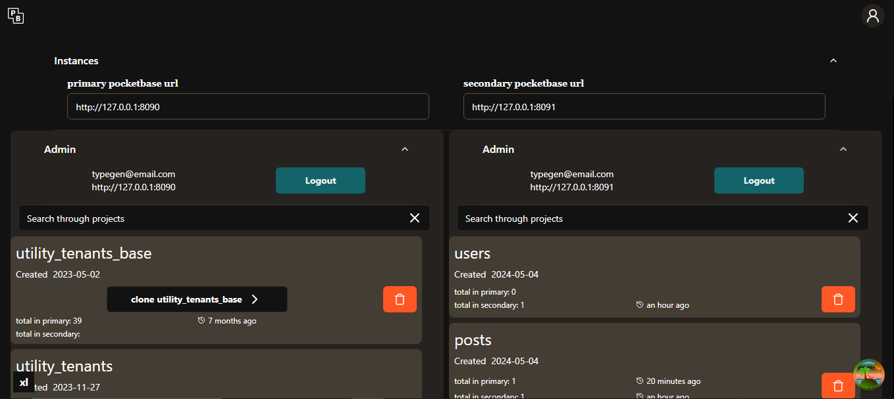

# Pocketbase sync

Sync your Pocketbase instance your local instance with the remote one 

supports 
- creating collections with all the rules and validations
- creaeting all the data from the local instance to the remote one

